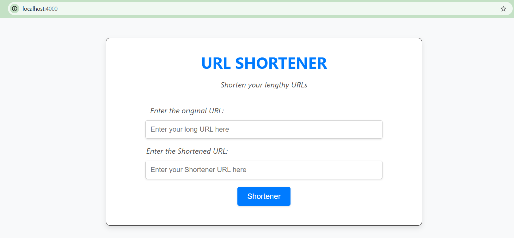
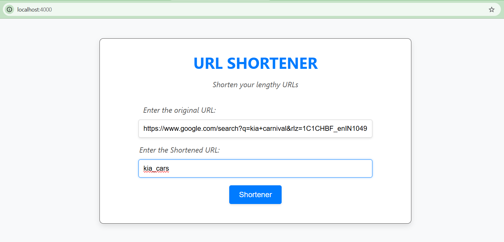
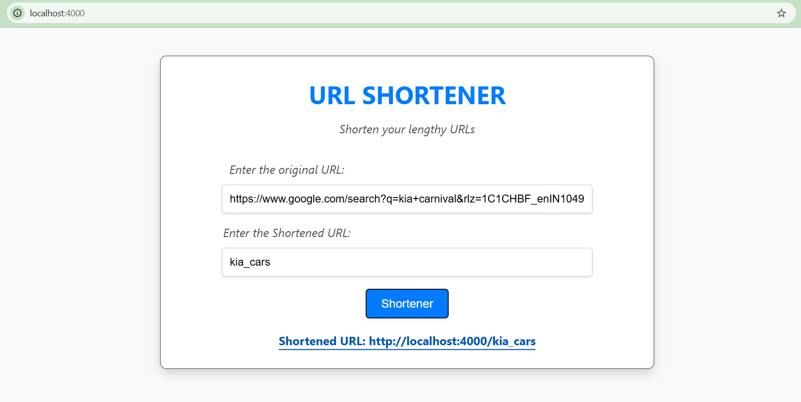

# URL Shortener App

## Overview
The URL Shortener App is a simple web application that allows users to create shortened URLs for long web addresses. This project provides an API for creating shortened URLs and redirecting users to the original URLs.

## Available APIs
- [1. Create Shortened URL](#1-create-shortened-url)
- [2. Redirect to Original URL](#2-redirect-to-original-url)

---


## Home Page Screenshots



## URL Page Screenshots



## API Documentation

### 1. Create Shortened URL
- **Endpoint:** `POST http://localhost:4000/shortener`
- **Description:** This API creates a shortened URL for the provided original URL.
- **Request Body:**
    ```json
    {
        "originalUrl": "https://www.google.com/search?q=kia+carnival&rlz=1C1CHBF_enIN1049IN1049&oq=&gs_lcrp=EgZjaHJvbWUqCQgBECMYJxjqAjIJCAAQIxgnGOoCMgkIARAjGCcY6gIyCQgCECMYJxjqAjIJCAMQIxgnGOoCMgkIBBAjGCcY6gIyCQgFECMYJxjqAjIJCAYQIxgnGOoCMgkIBxAjGCcY6gLSAQkzMjQ2MWowajeoAgiwAgE&sourceid=chrome&ie=UTF-8",
        "shortUrl": "kia_cars"
    }
    ```
- **Expected Response:**
    ```json
    {
        "success": true,
        "message": "Shortened URL created successfully",
        "shortenedUrl": "http://localhost:4000/kia_cars"
    }
    ```
- **CURL Example:**
    ```bash
    curl --location 'http://localhost:4000/shortener' \
    --header 'Content-Type: application/json' \
    --data '{
        "originalUrl": "https://www.google.com/search?q=kia+carnival&rlz=1C1CHBF_enIN1049IN1049&oq=&gs_lcrp=EgZjaHJvbWUqCQgBECMYJxjqAjIJCAAQIxgnGOoCMgkIARAjGCcY6gIyCQgCECMYJxjqAjIJCAMQIxgnGOoCMgkIBBAjGCcY6gIyCQgFECMYJxjqAjIJCAYQIxgnGOoCMgkIBxAjGCcY6gLSAQkzMjQ2MWowajeoAgiwAgE&sourceid=chrome&ie=UTF-8",
        "shortUrl": "kia_cars"
    }'
    ```


## Result Page Screenshots



### 2. Redirect to Original URL
- **Endpoint:** `GET http://localhost:4000/kia_cars`
- **Description:** This API redirects the user to the original URL associated with the shortened URL.
- **CURL Example:**
    ```bash
    curl --location 'http://localhost:4000/kia_cars' \
    --data ''
    ```
